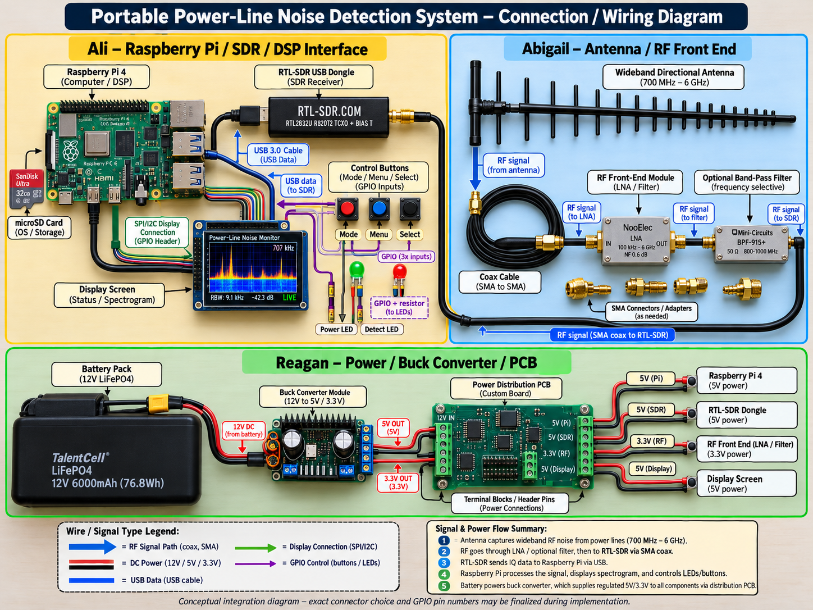

# Power Line Noise Detection, Analysis, and Location #2

## ECEN 403 Capstone Project - Texas A&M University

This repository is organized around the team's current subsystem responsibilities and the interfaces between them.

## System Architecture

```text
Antenna
  |
  v
RF Front End
  |
  v
SDR
  |
  v
Raspberry Pi 4
  |
  v
DSP / Detection
  |
  v
Controls / Status / User Interface
```

Power is supplied through the separate power/PCB integration path:

```text
Battery / Power Source
        |
        v
Buck Converter / Regulation
        |
        v
PCB Power Distribution
   |       |       |
   v       v       v
RF Front  SDR   Raspberry Pi / Controls
End
```

## Physical Prototype and Wiring

The following diagram shows the current **conceptual physical connection plan** for the three subsystems.



### Main signal path

```text
Antenna
  -> RF coax / connector
  -> RF front end
  -> RF coax / connector
  -> SDR RF input
  -> USB I/Q data
  -> Raspberry Pi 4
  -> DSP / detection
  -> display + LEDs + controls
```

### Ali subsystem connections

- SDR connects to the Raspberry Pi 4 by USB. The USB connection carries I/Q data and normally supplies power to the SDR.
- Raspberry Pi runs the DSP/detection software and handles the user interface.
- Display connects to the Raspberry Pi using the interface required by the selected display, expected to be I2C or SPI.
- Control buttons connect to Raspberry Pi GPIO inputs using an appropriate pull-up or pull-down configuration.
- Proposed LED connection is `GPIO -> current-limiting resistor -> LED -> GND`.
- Exact GPIO pin numbers will be finalized when the physical controls and display are selected.

### Abigail subsystem connections

- Antenna connects to the RF front end through the RF cable/connector selected for the final hardware.
- RF front end provides the required filtering, protection, matching, and amplification if testing shows an LNA is needed.
- RF front-end output connects to the SDR RF input through the RF signal path.
- RF cabling should remain impedance-matched to the selected SDR/front-end hardware.

### Reagan subsystem connections

- Battery/power source feeds the voltage-regulation section.
- Buck converter/regulators create the rails required by the Raspberry Pi, RF front end, display, and any other powered modules.
- The power-distribution PCB provides the final power connections and common ground where required.
- Each module's required voltage, current, connector, fuse/protection, and grounding arrangement must be verified before final wiring.

> **Important:** This is a conceptual integration diagram. Exact antenna, RF-front-end components, SDR model, connector types, supply rails, GPIO pin numbers, LED resistor values, and display interface must be verified against the final selected hardware before assembly.

## Subsystems

### 1. Ali Hussein - SDR, Raspberry Pi 4, Controls/UI, DSP/Detection

Main work areas:
- SDR and I/Q acquisition
- MATLAB DSP and detector development
- Real-field and synthetic-data validation
- Raspberry Pi 4 implementation
- GPIO buttons, LEDs, and optional display/UI

Current detector work is stored under:

`02_Subsystems/01_Ali_Hussein_SDR_RaspberryPi_DSP_Detection/`

The current MATLAB work includes the detector development history through `ali_detector_v10.m`, synthetic test signals, four real SDR field recordings, and detector result CSV files.

### 2. Reagan Carlton - Spark/RF Characterization, Power, PCB Integration

Main work areas:
- Spark source and RF characterization
- Battery / power supply
- Buck converter / voltage regulation
- Power budget and distribution
- PCB schematic and layout
- Connectors, pinout, BOM, and fabrication files

Stored under:

`02_Subsystems/02_Reagan_Carlton_Spark_RF_Power_PCB/`

### 3. Abigail Purchla - Antenna and RF Front End

Main work areas:
- Antenna design/selection
- RF front-end design
- Filtering
- LNA/amplification if needed
- Matching/protection
- RF testing and measurements

Stored under:

`02_Subsystems/03_Abigail_Purchla_Antenna_RF_Front_End/`

## Shared System Integration

Shared interface definitions, system diagrams, common components, and integration tests are stored under:

`03_Shared_System_Integration/`

See:

`03_Shared_System_Integration/Interfaces/SUBSYSTEM_OWNERSHIP.md`

## Ali DSP/Detection Progress

The current DSP prototype has progressed through:
- loading and processing complex SDR I/Q data
- spark-only vs white-noise comparison
- Peak/RMS impulsiveness feature
- individual candidate-event detection
- synthetic 120 Hz repetition validation
- real-field transient analysis
- 60 Hz cycle-fold / phase analysis
- combined impulsiveness + phase-dependent detector (`ali_detector_v10.m`)

The real field recordings remain observational data. Detector output should be described as candidate RF behavior unless controlled testing establishes source attribution.

## Repository Layout

```text
Power-Line-Noise-Detection/
|
|-- 01_Project_Documents/
|
|-- 02_Subsystems/
|   |-- 01_Ali_Hussein_SDR_RaspberryPi_DSP_Detection/
|   |-- 02_Reagan_Carlton_Spark_RF_Power_PCB/
|   `-- 03_Abigail_Purchla_Antenna_RF_Front_End/
|
|-- 03_Shared_System_Integration/
|
|-- 07_Testing_and_Validation/
|
|-- 08_Presentations_and_Reports/
|
|-- 09_Sponsor_Reference_Files/
|
`-- docs/images/
```

## Project Leadership

- Sponsor: Dr. Tom Talley
- Course Instructor: Dr. John Lusher II
- Course: ECEN 403 Capstone
- University: Texas A&M University

## Main Tools

- MATLAB
- Simulink
- RTL-SDR / SDR receiver
- Raspberry Pi 4
- Altium Designer
- Git / GitHub

## Engineering Note

Keep clear separation between:
- sponsor/reference material
- simulation results
- measured field data
- engineering assumptions
- candidate detector classifications
- controlled validation results
